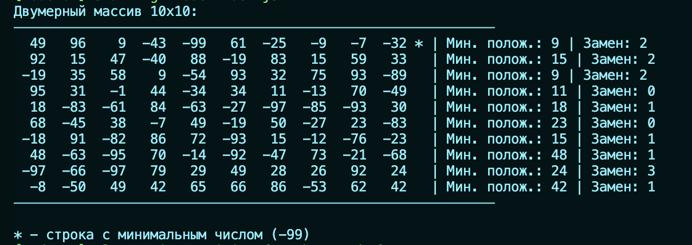

# Проект: Анализ двумерного массива

Проект на Node.js для работы с двумерным массивом случайных чисел и его анализа.

## Описание

Нужно создать двумерный массив 10х10 с случайными числами в интервале [-100..100]
Вывести этот массив в консоль в читаемом виде
В выведенном массиве:
- Пометить строку с минимальным числом - звездочкой
- В каждой строке вывести наименьшее положительное число
- В каждой строке написать какое минимальное кол-во чисел необходимо заменить чтобы не встречалось 3 положительных или отрицательных числа подряд.

По мимо правильности решения будет учитываться человекочитаемость и понятность выведенных данных.
Платформа выполнения NodeJS. Не допускается использование сторонних библиотек.

## Требования

- Node.js (версия 12.0 или выше)

## Установка

1. Склонируйте репозиторий

## Установка

```bash
npm install
```

## Запуск

```bash
npm run start
```

## Пример вывода



## Вывод в консоли
- `Двумерный массив 10x10:` - двумерный массив в консоли
- `*` - отмечает строку с минимальным числом во всем массиве
- `Мін.полож` - минимальное положительное число в строке (или "нет", если положительных нет)
- `Замен` - минимальное количество чисел, которые нужно заменить, чтобы не было 3 положительных или 3 отрицательных чисел подряд